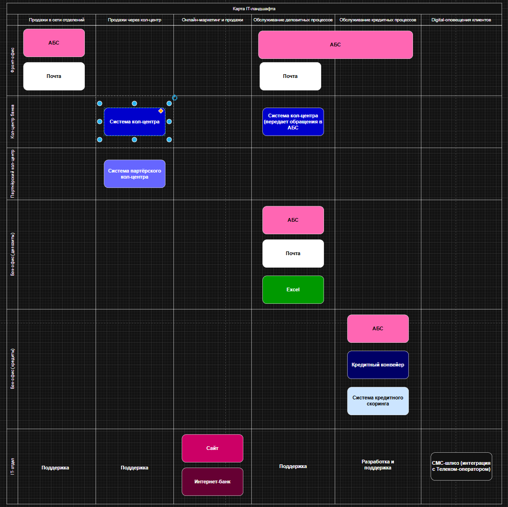
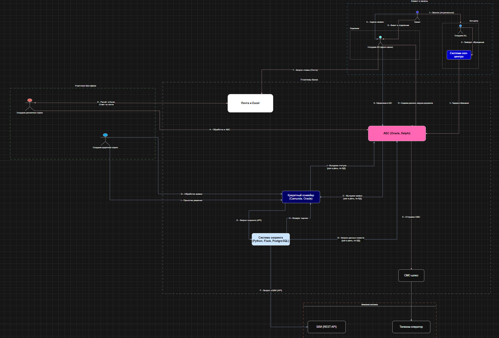

# architecture-pro-standart-s3
Работа с требованиями и стейкхолдерами

## Задание 1. Карта IT-ландшафта и схема интеграции приложений (As-Is)

В рамках первого задания был проведен анализ текущего состояния (As-Is) IT-инфраструктуры и бизнес-процессов банка "Стандарт". Целью было визуализировать существующие системы, их взаимодействие и привязку к организационной структуре для выявления узких мест и неэффективных участков, мешающих цифровой трансформации.

Были созданы два ключевых артефакта, отражающие текущие процессы открытия депозита и кредита:

1.  **Карта IT-ландшафта**: Матрица, показывающая, какие IT-системы и инструменты используются различными подразделениями банка для реализации их ключевых бизнес-возможностей.
    - Ссылка на файл: [`task1/IT-map.drawio`](./task1/IT-map.drawio)

2.  **Схема интеграции приложений**: Диаграмма, детально визуализирующая последовательность шагов и потоки данных между системами и участниками процессов.
    - Ссылка на файл: [`task1/IntegrationScheme.drawio`](./task1/IntegrationScheme.drawio)

Эти диаграммы служат отправной точкой для дальнейшего анализа и проектирования целевой архитектуры (To-Be).
